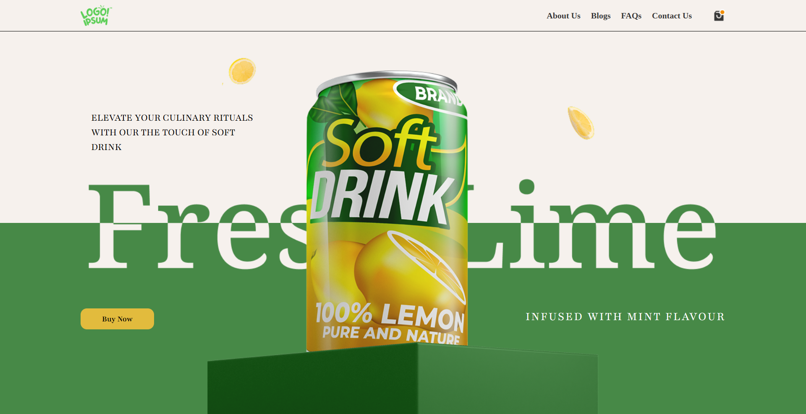

<h1 align="center">🚀 React Hero Collection</h1>

25+ Modern Hero Sections built with React, Tailwind CSS & Framer Motion

---

## 🎯 Project Overview

This repository is a collection of **25 hero sections**, built to sharpen UI/UX skills using:

- ⚛️ React.js  
- 🎨 Tailwind CSS  
- 🎞 Framer Motion  
- 🌐 React Router DOM  
- 💡 React Icons  

Each section is routed individually (e.g., `/hero1`, `/hero2`, etc.) and showcases different design patterns, layouts, animations, and interactions.

---

## 🎨 Design Inspiration

These hero sections are directly inspired by a beautiful open-source Figma collection:

📎 [**Figma Design Source** – Collection of 25 Hero Sections – Vol. 01 (Community)](https://www.figma.com/design/hrfivWmR8casNgU8PAUYSY/Collection-of-25-hero-sections---Vol-01--Community-?node-id=0-1&p=f&m=draw)

This practice helps me convert visual design to actual code using modern frontend tools.

---

## 🛠️ Tech Stack Used

- **React** – component-based architecture  
- **Tailwind CSS** – fast and efficient styling  
- **Framer Motion** – smooth and declarative animations  
- **React Router DOM** – for navigation between hero sections  
- **React Icons** – lightweight icons for UI polish

---
## 🎯 Project Goal

> The goal is to **practice real-world hero section designs** after learning Framer Motion — improve layout skills, animation integration, and Figma-to-code workflow.

---

## 📸 Hero Sections Preview

We are continuously adding more beautiful and responsive Hero sections.  
Stay tuned — more are **Coming Soon**!

Here’s a quick preview of one of them:

| 🧩 Hero Example         | 🖼️ Screenshot                                      |
|------------------------|--------------------------------------------------|
| Hero 1 (Desktop)       |  |
| Hero 1 (Mobile)        |  |

#### 🚀 **Live Demo:** [Click Here To View all hero ](https://your-vercel-demo-url.vercel.app)
---

### ❤️ Made with Love [**Rahul Kumar**](https://github.com/rahulydw)
